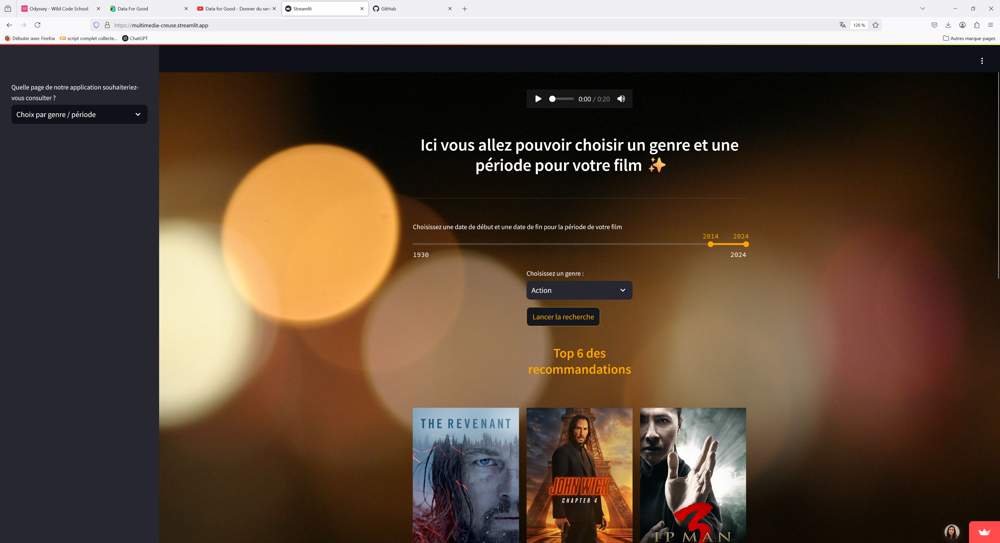

# ProjetCollectifCinema
Voici un espace de travail collaboratif utilisé dans le cadre notre deuxième projet.
Le client a fixé deux objectifs :
- créer un outil de visualisation donnant à voir des indicateurs statistiques et des KPIs pertinents pour favoriser le développement de son cinéma;
- concevoir une interface de recommandation de films pour prolonger l’expérience cinématographique des clients au-delà de la salle de cinéma.

Nous avons procédé au nettoyage et à l’analyse des données cinématographiques nationales grâce à des outils comme Pandas, Matplotlib et Seaborn. Puis, nous avons élaboré l'interface de recommandation avec Streamlit et utilisé le Machine Learning à l'aide d'outils comme Scikit-Learn. 

Nous procèderons à l’affinage du contenu et de la présentation des produits en fonction des préférences indiquées par le client.

Voici le lien pour accéder au streamlit :

https://multimedia-creuse.streamlit.app/

N'hésitez pas à me contacter si vous souhaitez que je "réveille" l'application !

## Bootcamp Data Analysis réalisé à la Wild Code School
Antoine, Catherine, Fabrice, Mainell & Myriam

